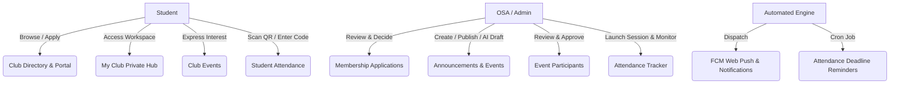
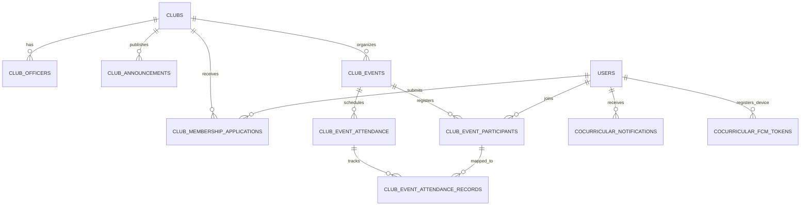
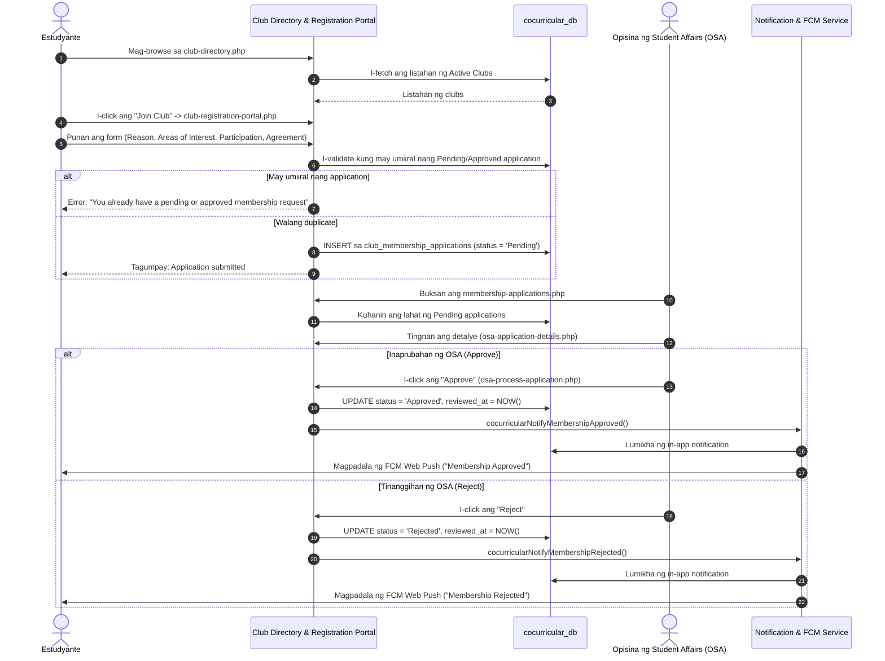
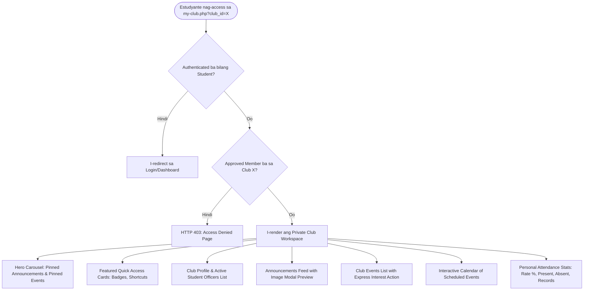
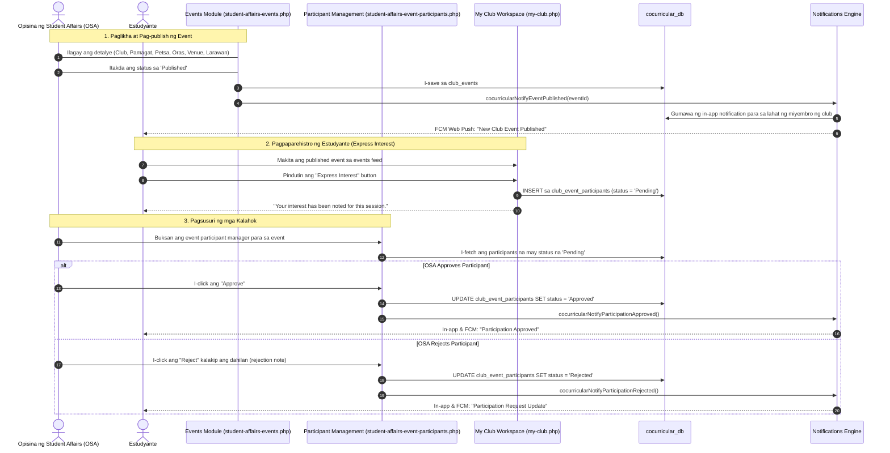
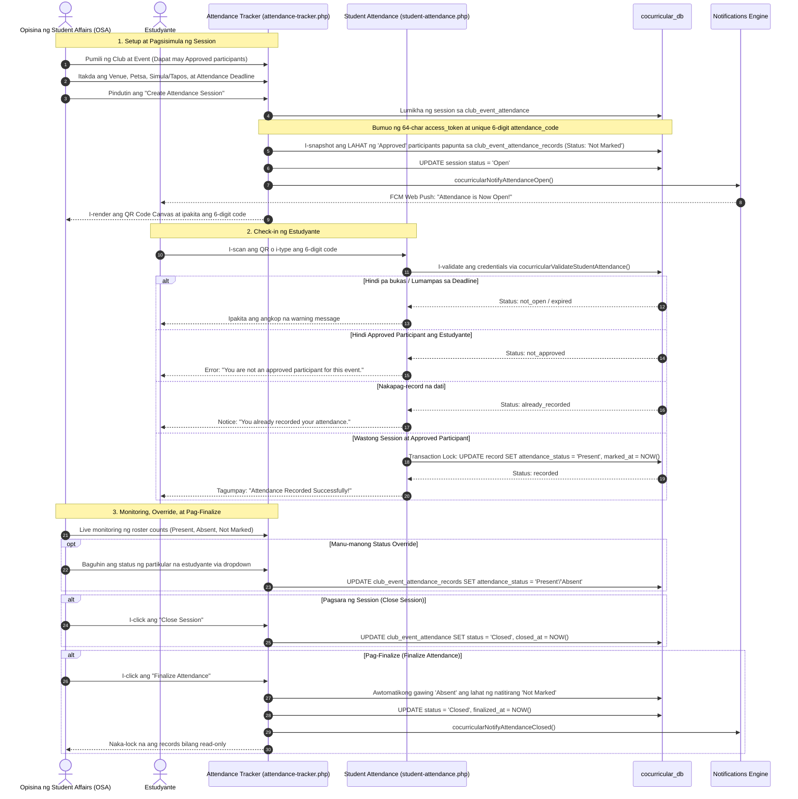
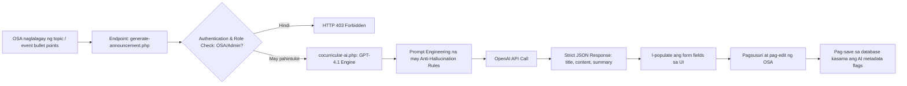
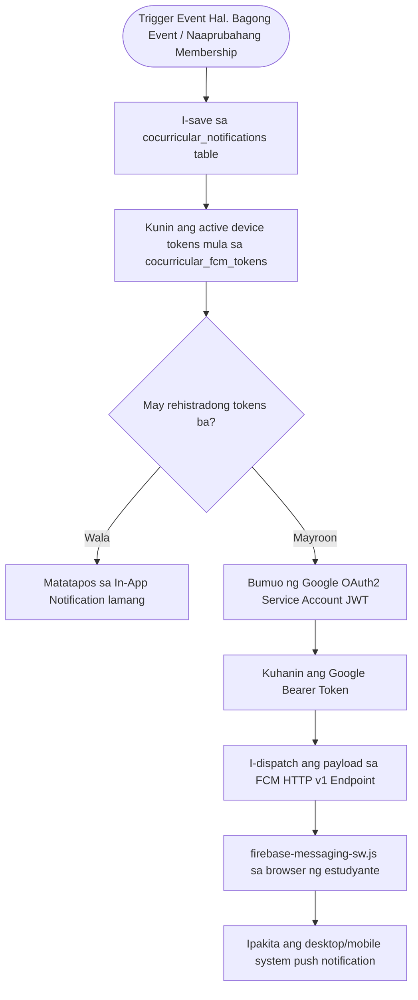
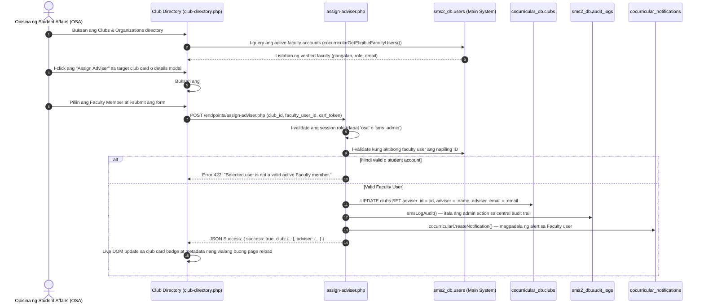
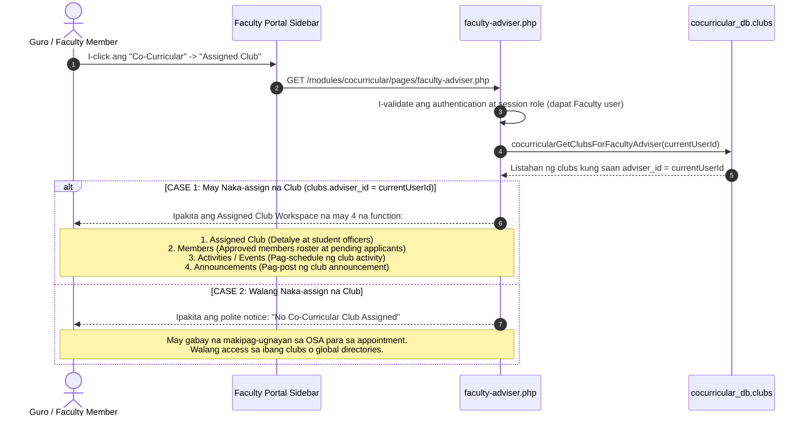

# Co-Curricular Module — Current Process & System Workflow Documentation
**Bestlink College of the Philippines — Student Management System 2 (SMS2 Capstone)**  
**Target Module:** `modules/cocurricular`  
**Date:** September 2026  
**Status:** Active & Fully Documented  

---

## 1. Executive Overview & Scope

Ang dokumentong ito ay naglalaman ng kabuuang sistema at daloy ng operasyon (end-to-end business logic and process workflow) para sa **Co-Curricular Module** lamang (`modules/cocurricular`).

Ang Co-Curricular Module ay nakadisenyo para sa pamamahala ng mga student organizations, club memberships, campus events, automated/QR attendance tracking, AI-assisted announcements, at real-time push notifications para sa Bestlink College of the Philippines (BCP).

### Pangunahing mga Aktor (System Roles)

1. **Student (`role: student`)**:
   - Nagba-browse ng mga rehistradong club sa direktoryo.
   - Nagpapasa ng membership application kalakip ang reason, interest, at kasunduan.
   - Tinitingnan ang status ng mga application sa membership tracker.
   - Pumapasok sa eksklusibong **My Club Workspace** (`my-club.php`) kapag naaprubahan.
   - Nagpapakita ng interes o nagpaparehistro sa mga club events.
   - Nagche-check in sa attendance sa pamamagitan ng pag-scan ng QR Code o pag-input ng 6-digit session code.
   - Tinitingnan ang personal na attendance rate (Present/Absent/Total) at calendar schedule.
   - Tumatanggap ng in-app notification at web push alert.

2. **Office of Student Affairs / Administrator (`role: osa`, `sms_admin`)**:
   - Sinusuri, inaaprubahan, o tinatanggihan ang membership applications ng mga estudyante.
   - Gumagawa at nagpa-publish ng mga opisyal na anunsyo gamit ang manual entry o **AI-assisted announcement draft generator** (OpenAI GPT-4.1).
   - Nagtatakda at nag-aayos ng mga club events (Draft, Published, Completed, Cancelled).
   - Sinusuri ang listahan ng mga kalahok sa event (Express Interest) at inaaprubahan sila bago ang attendance.
   - Nagpapasimula ng **Attendance Session** para sa event, nagtatakda ng deadline at location, nagpapakita ng live QR code at numerical code.
   - Sinusubaybayan ang live attendance roster, nagmamano-manong status override kung kinakailangan, at nag-fi-finalize ng session (awtomatikong nagiging *Absent* ang mga hindi nakapag-check-in).

3. **System Background Services / Automated Jobs**:
   - Awtomatikong nagpapadala ng in-app notification sa bawat state change.
   - Nagpapadala ng Web Push Notifications gamit ang Firebase Cloud Messaging (FCM HTTP v1).
   - Scheduled CLI/Cron job para sa pagsusuri ng mga bukas na attendance sessions at pagpapadala ng deadline reminders sa mga hindi pa nakakapag-check in.

---

## 2. Database Architecture (`cocurricular_db`)

Ang buong operasyon ng Co-Curricular module ay naka-isolate sa sariling database na `cocurricular_db` na may foreign key relations patungo sa sentral na `sms2_db.users`.

### Detalye ng mga Talahanayan (Tables)

| Talahanayan (Table) | Deskripsyon at Tungkulin |
| :--- | :--- |
| `clubs` | Impormasyon ng organisasyon: pangalan, kategorya (Academic, Athletics, etc.), adviser (`adviser_id` na naka-link sa `sms2_db.users`), email, phone, at status (`Active`, `Pending`, `Inactive`). |
| `club_officers` | Listahan ng student officers (President, VP, Secretary, etc.) bawat club. |
| `club_membership_applications` | Talaan ng aplikasyon ng estudyante. May hawak ng `reason_for_joining`, `areas_of_interest`, `preferred_participation`, `agreement`, at status (`Pending`, `Approved`, `Rejected`). |
| `club_announcements` | Mga anunsyo ng club na may pinning flag, image/attachment path, at AI metadata columns (`is_ai_generated`, `ai_model`, `ai_generated_at`). |
| `club_events` | Mga aktibidad at okasyon ng club na may date, start/end time, venue, image, pinned state, at status (`Draft`, `Published`, `Completed`, `Cancelled`). |
| `club_event_participants` | Listahan ng mga estudyanteng nag-express ng interes sa event kasama ang review status (`Pending`, `Approved`, `Rejected`) at rejection note. |
| `club_event_attendance` | Master attendance sessions ng isang event. May hawak ng `access_token` (QR token), 6-digit `attendance_code`, `status` (`Not Started`, `Open`, `Closed`), `attendance_open_at`, `attendance_deadline`, at `finalized_at`. |
| `club_event_attendance_records` | Individual attendance roster ng bawat naaprubahang kalahok. May hawak ng `attendance_status` (`Not Marked`, `Present`, `Absent`), `marked_at`, at `marked_by`. |
| `cocurricular_notifications` | In-app notification queue para sa lahat ng alerto ng co-curricular module na may unread state tracker. |
| `cocurricular_fcm_tokens` | Browser Web Push tokens na nirehistro ng bawat user para sa Firebase Cloud Messaging notifications. |

---

## 3. Mga Detalyadong Proseso (Core End-to-End Processes)

---

### Process 1: Club Discovery at Membership Application Flow

Ang proseso mula sa paghahanap ng club ng estudyante hanggang sa pag-apruba ng OSA.

#### Mahalagang Business Rules sa Membership:
1. Ang mga estudyante lamang na may `Approved` status ang pinapayagang pumasok sa private workspace ng club (`my-club.php`).
2. Kapag ang isang aplikasyon ay Pending pa, hindi na maaaring mag-submit muli ng bagong aplikasyon para sa parehong club (anti-spam / idempotency guard).
3. Ang mga `Active` clubs lamang ang maaaring apply-an ng mga estudyante.

---

### Process 2: Private Club Workspace Lifecycle (`my-club.php`)

Kapag naaprubahan na ang membership ng estudyante sa isang club, nabubuksan ang buong workspace dashboard:

#### Mga Tampok sa Workspace Dashboard:
- **Strict Authorization Guard:** Diretsong tumatawag sa `cocurricularFetchApprovedMembershipForClub()`. Kung walang aprubadong record, haharangin ng HTTP 403 template.
- **Hero Carousel:** Awtomatikong pinagsasama ang mga pinned announcements at pinned events upang unahin ang pinakamahahalagang balita sa itaas ng screen.
- **Interactive Calendar:** Biswal na minamarkahan ang mga araw na may nakatakdang okasyon, at kapag pinindot ang petsa ay ipinapakita ang kaugnay na kaganapan.
- **Attendance Summary:** Mabilisang ipinapakita sa estudyante ang kanilang personal attendance percentage laban sa lahat ng natapos na sessions.

---

### Process 3: Event Management at Participant Registration

Ang lifecycle ng paglikha ng event, pagpapaskil, pagpaparehistro ng estudyante, at pagsusuri ng OSA.

---

### Process 4: QR Code at Attendance Code Tracking Session Flow

Ito ang pinakamahalagang real-time feature ng Co-Curricular module. Sinisiguro nito ang maayos, automated, at tamper-proof na pagkuha ng presensya ng mga estudyante.

#### Mahigpit na Security at Validation Controls sa Attendance:
1. **Participant Eligibility Snapshot:** Tanging ang mga estudyanteng may `Approved` registration sa `club_event_participants` ang isasama sa attendance roster record. Ang mga `Pending` o `Rejected` ay hindi makakapag-check-in kahit may QR code.
2. **Time Window Restriction:** Ang check-in ay tatanggapin lamang kapag `NOW() >= attendance_open_at` at `NOW() <= attendance_deadline`. Kapag lumampas sa deadline, awtomatikong nire-reject ang request at minamarkahang expired.
3. **Pagsugpo sa Race Conditions:** Gumagamit ng database transactions na may `FOR UPDATE` table row locking sa panahon ng validation at submission para maiwasan ang double submission.
4. **Permanent Finalization:** Sa sandaling i-finalize ang attendance, ang anumang natitirang `Not Marked` ay awtomatikong itinatakda sa `Absent`, at ang buong session ay nala-lock laban sa anumang pagbabago.

---

### Process 5: AI-Assisted Announcement Drafting Workflow

Ang Co-Curricular module ay may integrasyon sa OpenAI GPT-4.1 upang tulungan ang OSA at club leaders na makagawa ng de-kalidad at nakakaakit na mga anunsyo nang mabilisan.

#### Mga Panuntunan sa Prompt Engineering ng AI:
- **Anti-Hallucination Safeguard:** Mahigpit na ipinagbabawal sa AI model ang pag-imbento ng mga detalye tulad ng petsa, oras, venue, bayarin, o mga tagapagsalita na hindi ibinigay sa orihinal na inputs.
- **Academic Tone:** Ang draft ay gumagamit ng pormal, nakakaengganyo, at angkop na wika para sa mga kolehiyo sa Bestlink College of the Philippines.
- **Audit Trail:** Bawat anunsyong binuo sa tulong ng AI ay minamarkahan sa database gamit ang `is_ai_generated = 1`, `ai_model = 'gpt-4.1'`, at timestamp ng pagkagawa (`ai_generated_at`).

---

### Process 6: Push Notifications at Firebase Cloud Messaging (FCM)

Ang sistema ay nagpapadala ng parehong **In-App Notifications** at **Web Push Notifications** upang manatiling updated ang mga estudyante kahit hindi nila aktibong binubuksan ang app.

#### Mga Suportadong Uri ng Notification (`type`):
- `membership_approved` — Naaprubahan ang pagsali sa club.
- `membership_rejected` — Hindi naaprubahan ang pagsali sa club.
- `announcement_published` — Bagong opisyal na anunsyo mula sa club.
- `event_published` — Bagong aktibidad o okasyon na inilathala.
- `participation_approved` — Naaprubahan ang paglahok sa partikular na event.
- `participation_rejected` — Tinanggihan ang paglahok kalakip ang paliwanag.
- `attendance_open` — Bukas na ang check-in para sa dinaluhang okasyon.
- `attendance_closed` — Isinara na ang sesyon ng attendance.
- `attendance_deadline_reminder` — Paalala na malapit nang matapos ang oras ng pagche-check in.

---

### Process 7: Automated Scheduled Jobs (Attendance Reminders)

Ang background job para sa regular na pagsubaybay ng mga aktibong sessions:

- **File Path:** `modules/cocurricular/jobs/process-attendance-notifications.php`
- **Paraan ng Pagpapatakbo:** CLI Cron Job (`php modules/cocurricular/jobs/process-attendance-notifications.php`) o protektadong server endpoint.
- **Lohika:**
  1. Ini-scan ang lahat ng `Open` attendance sessions.
  2. Kinakalkula ang natitirang oras bago ang `attendance_deadline` (default: 30 minuto bago ang cut-off).
  3. Hinahanap ang mga estudyanteng `Approved` ang registration ngunit `Not Marked` pa rin ang estado sa attendance roster.
  4. Nagpapadala ng `attendance_deadline_reminder` alert sa kanilang mga device upang maiwasan ang pagiging absent nang hindi sinasadya.

---

### Process 8: Pag-assign ng Faculty Adviser ng OSA (Assign Faculty Adviser Flow)

Ang proseso kung saan ang Office of Student Affairs (OSA) o Administrator ay nagtatalaga ng opisyal na Faculty Adviser sa isang student club:

- **Mga Pangunahing Tuntunin:**
  1. Ang mga user account ng mga guro ay hindi dinuduplika sa `cocurricular_db`. Kinukuha ang mga ito nang direkta mula sa `sms2_db.users`.
  2. Ang relasyon ay iniimbak sa `cocurricular_db.clubs.adviser_id` (FOREIGN KEY sa `sms2_db.users(id)`).
  3. Kasabay na ina-update ang `adviser` at `adviser_email` sa `clubs` table para mapanatili ang backwards-compatibility sa mga umiiral na student searches at queries.
  4. Maaari ring mag-unassign (alisin ang adviser) sa pamamagitan ng pagpili sa "-- Remove / Unassign Adviser --" (itatalaga ang `adviser_id = NULL` at `adviser = 'None'`).

---

### Process 9: Integrasyon ng Faculty Adviser sa Faculty Portal (Faculty Portal Co-Curricular Integration Flow)

Ang proseso kung saan ang isang guro (Faculty) ay nagna-navigate mula sa Faculty Portal patungo sa Co-Curricular module:

- **Mga Pangunahing Tuntunin:**
  1. **Walang hiwalay na portal:** Ang Faculty Adviser ay dumaraan sa umiiral na Faculty Portal (`includes/sidebar.php`).
  2. **Assigned Club Scope Only:** Ang guro ay may access lamang sa datos ng organisasyong nakatalaga sa kanya (`clubs.adviser_id == logged_in_user_id`). Mahigpit na ipinagbabawal ang pag-access sa ibang samahan.
  3. **Attendance Exclusion:** Ang pamamahala ng attendance ay mananatili sa OSA/Admin at hindi ibinibigay sa Faculty Adviser.
  4. **Eksklusibong Awtoridad ng OSA sa Membership Approval/Rejection (View-Only para sa Adviser):** Ang pagsusuri, pag-apruba, at pagtanggi sa mga aplikasyon sa pagsali (`club_membership_applications`) ay eksklusibong tungkulin ng Office of Student Affairs (OSA). Hindi pinahihintulutan ang Faculty Adviser na mag-apruba o mag-reject ng pending applications; ang listahan ng mga aplikante sa kanilang workspace ay mahigpit na **View-Only** (para sa kamalayan at monitoring ng club) at hindi binabago ang umiiral na daloy ng OSA sa `membership-applications.php` at `osa-process-application.php`.

---

## 4. Talaan ng mga File at Submodules (File Structure Inventory)

### Mga Aktibong Pahina (Active Working Pages)
- [club-directory.php](file:///c:/xampp/htdocs/sms2-capstone/modules/cocurricular/pages/club-directory.php) — Direktoryo at pamamahala ng mga clubs; may integrated "Assign Adviser" modal para sa OSA/Admin.
- [faculty-adviser.php](file:///c:/xampp/htdocs/sms2-capstone/modules/cocurricular/pages/faculty-adviser.php) — Dedicated workspace para sa Faculty Adviser mula sa Faculty Portal (Assigned Club, Members, Events, Announcements).
- [club-registration-portal.php](file:///c:/xampp/htdocs/sms2-capstone/modules/cocurricular/pages/club-registration-portal.php) — Aplikasyon sa pagsali sa club para sa mga estudyante.
- [student-club-membership.php](file:///c:/xampp/htdocs/sms2-capstone/modules/cocurricular/pages/student-club-membership.php) — Sinusubaybayan ang katayuan ng aplikasyon at mga sinalihang samahan.
- [my-club.php](file:///c:/xampp/htdocs/sms2-capstone/modules/cocurricular/pages/my-club.php) — Sentral na dashboard para sa naaprubahang miyembro ng club.
- [membership-applications.php](file:///c:/xampp/htdocs/sms2-capstone/modules/cocurricular/pages/membership-applications.php) — Pamamahala at pagsusuri ng OSA sa mga membership applications.
- [osa-process-application.php](file:///c:/xampp/htdocs/sms2-capstone/modules/cocurricular/pages/osa-process-application.php) — Backend action processor para sa pag-apruba at pagtanggi ng membership.
- [osa-application-details.php](file:///c:/xampp/htdocs/sms2-capstone/modules/cocurricular/pages/osa-application-details.php) — Modal view ng kumpletong detalye ng aplikasyon ng estudyante.
- [student-affairs-events.php](file:///c:/xampp/htdocs/sms2-capstone/modules/cocurricular/pages/student-affairs-events.php) — Pamamahala ng mga events ng OSA (likha, i-edit, i-publish, larawan).
- [student-affairs-event-participants.php](file:///c:/xampp/htdocs/sms2-capstone/modules/cocurricular/pages/student-affairs-event-participants.php) — Pagsusuri at pag-apruba ng mga kalahok sa okasyon.
- [student-affairs-announcements.php](file:///c:/xampp/htdocs/sms2-capstone/modules/cocurricular/pages/student-affairs-announcements.php) — Paglikha ng anunsyo at integrasyon sa AI assistant.
- [attendance-tracker.php](file:///c:/xampp/htdocs/sms2-capstone/modules/cocurricular/pages/attendance-tracker.php) — Live attendance dashboard para sa OSA (QR generator, code display, roster).
- [attendance-process.php](file:///c:/xampp/htdocs/sms2-capstone/modules/cocurricular/pages/attendance-process.php) — Endpoint para sa paglikha, pag-update, at pag-finalize ng attendance session ng OSA.
- [student-attendance.php](file:///c:/xampp/htdocs/sms2-capstone/modules/cocurricular/pages/student-attendance.php) — Pahina ng estudyante para sa pag-check in gamit ang QR o code.
- [student-attendance-process.php](file:///c:/xampp/htdocs/sms2-capstone/modules/cocurricular/pages/student-attendance-process.php) — AJAX validation at submission endpoint para sa student check-in.
- [announcement-image.php](file:///c:/xampp/htdocs/sms2-capstone/modules/cocurricular/pages/announcement-image.php) & [event-image.php](file:///c:/xampp/htdocs/sms2-capstone/modules/cocurricular/pages/event-image.php) — Ligtas na naghahatid ng mga uploaded images na may tamang MIME type validation.

### Mga Serbisyo at Helper Scripts (Includes & Endpoints)
- [cocurricular-db.php](file:///c:/xampp/htdocs/sms2-capstone/modules/cocurricular/includes/cocurricular-db.php) — Komprehensibong data access layer, faculty query functions, adviser assignment routines, at faculty adviser workspace helpers.
- [assign-adviser.php](file:///c:/xampp/htdocs/sms2-capstone/modules/cocurricular/endpoints/assign-adviser.php) — Secure JSON AJAX endpoint para sa pag-assign at unassign ng Faculty Adviser ng OSA/Admin.
- [cocurricular_v3_adviser_migration.sql](file:///c:/xampp/htdocs/sms2-capstone/modules/cocurricular/database/cocurricular_v3_adviser_migration.sql) — SQL migration script para sa `adviser_id` column at foreign key index sa `cocurricular_db.clubs`.
- [cocurricular-ai.php](file:///c:/xampp/htdocs/sms2-capstone/modules/cocurricular/includes/cocurricular-ai.php) — OpenAI GPT-4.1 cURL client at prompt normalization service.
- [cocurricular-notifications.php](file:///c:/xampp/htdocs/sms2-capstone/modules/cocurricular/includes/cocurricular-notifications.php) — In-app notification creation at querying helpers.
- [cocurricular-notification-triggers.php](file:///c:/xampp/htdocs/sms2-capstone/modules/cocurricular/includes/cocurricular-notification-triggers.php) — Sentralisadong event triggers para sa lahat ng state updates.
- [cocurricular-fcm-dispatcher.php](file:///c:/xampp/htdocs/sms2-capstone/modules/cocurricular/includes/cocurricular-fcm-dispatcher.php) — Google Service Account OAuth2 JWT generator at FCM HTTP v1 client.
- [generate-announcement.php](file:///c:/xampp/htdocs/sms2-capstone/modules/cocurricular/endpoints/generate-announcement.php) — AJAX endpoint para sa AI announcement generator.
- [notifications.php](file:///c:/xampp/htdocs/sms2-capstone/modules/cocurricular/endpoints/notifications.php) — JSON endpoint para sa notification polling, count, at mark-as-read actions.
- [fcm-token.php](file:///c:/xampp/htdocs/sms2-capstone/modules/cocurricular/endpoints/fcm-token.php) — Nagtatala at nag-a-update ng FCM browser device tokens.
- [process-attendance-notifications.php](file:///c:/xampp/htdocs/sms2-capstone/modules/cocurricular/jobs/process-attendance-notifications.php) — Scheduled CLI cron processor.

### Mga Naka-staged na Submodule Placeholders (Future Scope)
Ang mga sumusunod na pahina ay nakatayo bilang placeholder gamit ang `submodule-process.php` bilang paghahanda sa susunod na yugto ng pagpapalawak ng Capstone:
- `budget-requests.php` — Pagpapasa at pagsubaybay sa pondo ng club.
- `club-officer-elections.php` — Halalan ng mga student officers.
- `club-achievement-records.php` — Talaan ng mga parangal at tagumpay ng samahan.
- `event-activity-logs.php` — Detalyadong kasaysayan ng mga naganap na aktibidad.
- `volunteer-hour-tracking.php` — Pagsubaybay sa oras ng serbisyo at volunteerism ng mga miyembro.
- `inter-school-communication.php` — Pakikipag-ugnayan sa ibang mga sangay o institusyon.

---

## 5. Buod ng Seguridad at UI/UX Standards

1. **Role-Based Access Control (RBAC):** Bawat pahina at API endpoint ay may mahigpit na pagsusuri ng session role gamit ang `requireAuth()`, `getCurrentUserRoleKey()`, at `smsIsGrantedAdminRole()`. Ang mga estudyante ay hindi makakapasok sa OSA routes, at ang hindi aprubadong estudyante ay hindi makakapasok sa pribadong `my-club.php`.
2. **Proteksyon sa File Uploads:** Ang lahat ng larawan para sa mga events at anunsyo ay dumadaan sa mahigpit na MIME-type verification, extension validation, at path normalization upang maiwasan ang arbitrary script execution o directory traversal.
3. **Pagsunod sa Tema (Theme Awareness):** Ang buong Co-Curricular CSS (`modules/cocurricular/assets/css/cocurricular.css`) ay sumusunod sa design system tokens ng SMS2 (`--sms-primary`, `--sms-surface`, `--sms-text`, atbp.) nang walang hardcoded hex colors, kaya ganap nitong sinusuportahan ang Light at Dark modes.
4. **Resiliency at Data Consistency:** Lahat ng kritikal na operasyon—lalo na ang pagkuha ng attendance at pagbabago ng estado ng mga aplikasyon—ay gumagamit ng PDO database transactions na may rollback capabilities.

---
*Dokumentong inihanda para sa BCP SMS2 Capstone Documentation Archive.*
